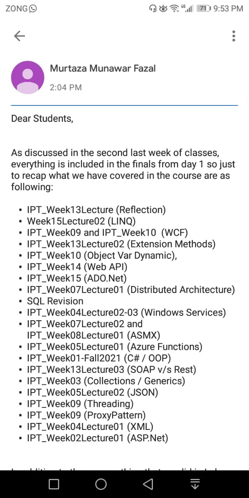

# Topics

## Sir Zain

### Recent

- WCF (Its basics, benefits over traditional web services, bindings, endpoints and contracts etc)
- Web services (Web APIs, Rest API, SOAP and all of its background, Web service vs Distributed objects)
- Reflection (Its motivation, usefulness & application, basic methods like the ones we covered in lab)
- LINQ and Ado.net (Comparison of LINQ/Ado.net, syntax and usage of both i.e. query syntax and extension methods)

### Topics covered before mid-term II

- JSON (Its basic syntax, types and rules, relation to C# code, relation to XML)
- Distributed Systems (Basic motivation, Client/Server architecture, Service-oriented architecture, Distributed objects)
- Proxy Design Pattern (Its skeleton code, and uses)
- Multithreading (Thread methods start( ), sleep( ) etc, C# implementation of threads)
- Azure Functions (Its application areas)
- .NET (CLR and basic concepts like var and dynamic keywords, ref/out keywords, JIT, managed/unmanaged code, access specifiers etc)
- ASP.NET (Postbacks, MVC and its relation to 3-tier architecture)
- Azure DevOps (only the basic motivation behind it)
- XML (Background and basics of XML e.g. elements and nodes, basic writing & reading from an XML file, writing & reading objects to XML file i.e. Serialization/Deserialization)
- Windows Services (Basic motivation and uses)

## Sir Murtaza

