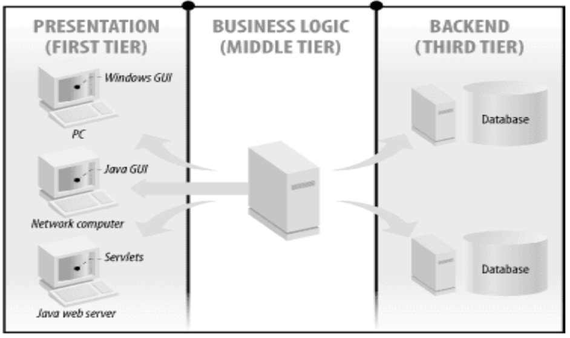
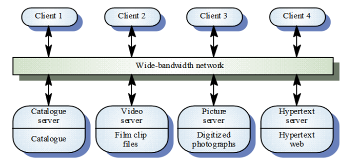
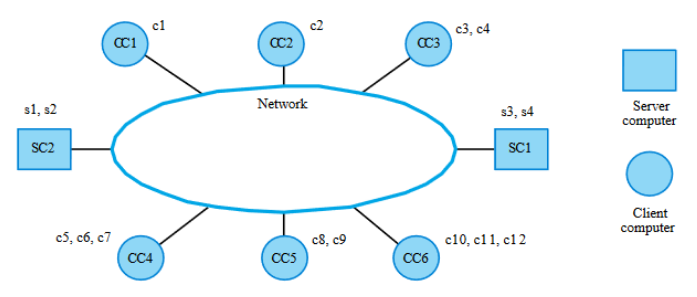
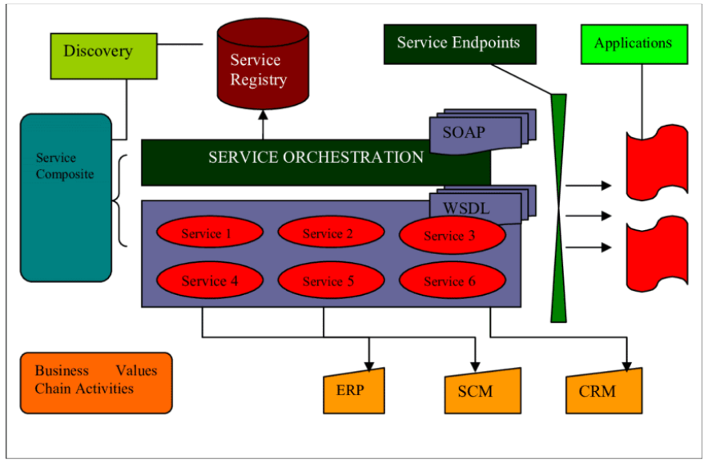

# Distributed Systems

## What

- Virtually all large computer-based systems are now distributed systems
- Information processing is distributed over several computers rather than confined to a single machine
- Different distributed systems architectures,
  - client-server
  - peer-to-peer
  - Parallel/cluster/grid computing
  - Distributed object architectures - CORBA; .NET; J2EE
  - Service-Oriented Architectures

## Architectures

## Client-service Architecture

- Distributed system model where data and processing is distributed across a range of components
- Set of servers which provide specific services such as printing, data management, etc.
- Set of clients which call on these services
- Network which allows clients to access servers
- Clients know of servers but servers need not know of clients

## Film & Picture Library

## Computers In A C/S Network

## Client-server characteristics

- Advantages
  - Distribution Of Data Is straightforward
  - Makes effective use of networked systems
  - May require cheaper hardware
  - Easy to add new servers or upgrade existing servers
- Disadvantages
  - No shared data model so sub-systems use different data organization-data interchange may be inefficient
  - Redundant management in each server
  - No central register of names and services - it may be hard to find out what servers and services are available

## Middleware

- Software that manages and supports the different components of the distributed system

## Layered Application Architecture

- Presentation Layer
- Application Processing Layer
- Data Management Layer

## Tiering

### Two-tier

A two-tier architecture is one where a client talks directly to a server, with no intervening server.

### Three-tier

A three-tier architecture introduces another server (or an "agent") between the client and the server.

## Thin & Fat Clients

- Thin-client model
- Fat-client model
  
## Scaling

Environment is typically heterogeneous and multi-vendor,

- Client-server systems can be scaled horizontally or vertically,
  - Horizontal scaling means adding or removing client workstations with only a slight performance impact

## Service Oriented Architecture

## Distributed Object Computing

- Building scalable solutions require applying the appropriate level of computing power to different parts of the application
- Distributed object computing extends an object-oriented programming system by allowing objects to coexist across a heterogeneous network and interact as if they resided on the same machine
- Distributed object systems have several problems

## OOP & Network Latency

- THe style of object-oriented programming directly conflicts with the performance of distributed system,
  - Object oriented classes are fine-grained, with property and field accessors
  - Object interactions lead to many round trips across the network. Network latency causes sever performance degradation. You want to minimize the number of interactions
