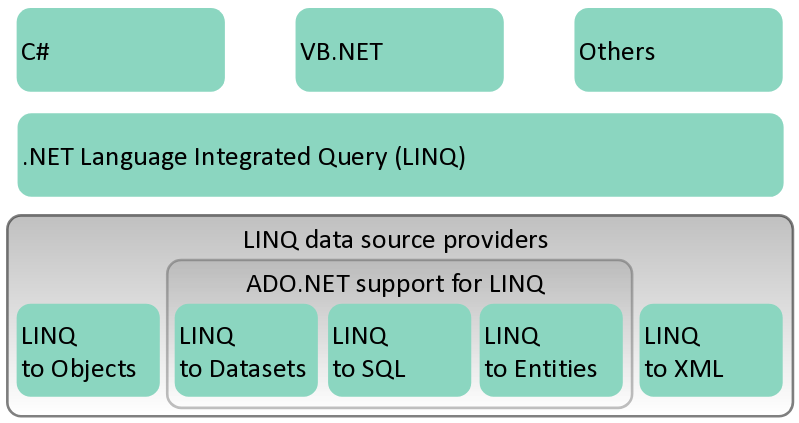

# LINQ

Language-Integrated Query (LINQ) is the name for a set of technologies based on the integration of query capabilities directly into the C# language

- Component of .NET Framework 3.5

## Architecture



## Benefits

- Traditionally, queries against data are expressed as simple strings without type checking at compile time or IntelliSense support.

- Furthermore, you have to learn a different query language for each type of data source: SQL databases, XML documents, various Web services, and so on.

- With LINQ, a query is a first-class language construct, just like classes, methods, events.

- The LINQ family of technologies provides a consistent query experience for objects (LINQ to Objects), relational databases (LINQ to SQL), and XML (LINQ to XML).

## Query Expression

For a developer who writes queries, the most visible "language-integrated" part of LINQ is the query expression.

You use the same basic query expression patterns to query and transform data in SQL databases, ADO.NET Datasets, XML documents and streams, and .NET collections.

You can write LINQ queries in C# for,

- SQL Server databases
- XML documents
- ADO.NET Datasets
- Any collection of objects that supports IEnumerable or the generic `IEnumerable<T>` interface

LINQ support is also provided by third parties for many Web services and other database implementations.

The following example shows the complete query operation. The complete operation includes creating a data source, defining the query expression, and executing the query in a `foreach` statement.

```csharp
class LINQQueryExpressions
{
    static void Main()
    {

        // Specify the data source.
        int[] scores = new int[] { 97, 92, 81, 60 };

        // Define the query expression.
        IEnumerable<int> scoreQuery =
            from score in scores
            where score > 80
            select score;

        // Execute the query.
        foreach (int i in scoreQuery)
        {
            Console.Write(i + " ");
        }
    }
}
// Output: 97 92 81
```

## Syntax

### Query Without LINQ

Objects using loops and conditions

```csharp
foreach(Customer c in customers)
   if (c.Region == “PAK") ...
```

Databases using SQL

```sql
SELECT * FROM Customers WHERE Region=‘PAK'
XML using XPath/XQuery
//Customers/Customer[@Region=‘PAK']
```

## To These

- LINQ to objects
- LING to SQL (formerly DLINQ)
- LINQ to XML (formerly XLINQ)
- LINQ to Entities (ADO.NET Entities)

## LINQ To Objects

- Query any `IEnumerable<T>` source
- Includes arrays, `List<T>`, Dictionary...
- Many useful operators available
  - Sum, Max, Min, Distinct, Intersect, Union
- Expose your own data with `IEnumerable<T>` or `IQueryable<T>`
- Create operators using extension methods

```csharp
int[] nums = new int[] {0,4,2,6,3,8,3,1};

double average = nums.Take(6).Average();
var above = from n in nums
            where n > average
            select n;
```

## Querying An Array Of Reference-Type Elements Using LINQ

- When you type the name of an IEnumerable object (such as an array or the result of a LINQ query) then type the dot (.) separator, the list of the methods and properties that can be used with that object are shown.

- Some of the methods are so-called extension methods.

- For example, if you have an array of Doubles called numbers and you want to calculate the average of its values, you can simply call the Average extension method, as in numbers.Average().

## LINQ Operators

### Aggregate

Aggregate, Average, Count, Max, Min, Sum

### Conversion

Cast, OfType, ToArray, ToDictionary, ToList, ToLookup, ToSequence

### Ordering

OrderBy, ThenBy, Descending, Reverse

### Partitioning

Skip, SkipWhile, Take, TakeWhile

### Sets

Concat, Distinct, Except, Intersect, Union

## DLINQ Setup

1. Create A Database
2. Create A ContextData file
3. Drag Tables On Designer
4. Connection String

`OperationDataContext`, `COURSE`. `SubmitChanges`, `DeleteOnSubmit`.

## Advantages

- Unified data access
  - Single syntax to learn and remember
- Strongly typed
  - Catch errors during compilation
- Intellisense
  - Prompt for syntax and attributes
- Bindable result sets

## Limitations

- LINQ
  - Only defines query, not update or context
- LINQ to SQL
  - Limited to SQL Server as backend
  - Requires at least .NET 3.5 to run
  - Somewhat limited in that tables are mapped strictly on a 1:1 basis (one table = one class)

## .NET features used

- .NET Framework 2.0
  - Partial classes (mapping)
- .NET Framework 3.5
  - Anonymous types (shaping)
  - Extension methods (query operators)
  - Type Inference
  - Lambda Expressions

## Resources

- Lecture 13A | LINQ

## References

- [First Class](http://wiki.c2.com//?FirstClass)
- [What is a first class programming construct?](https://stackoverflow.com/questions/646794/what-is-a-first-class-programming-construct)
