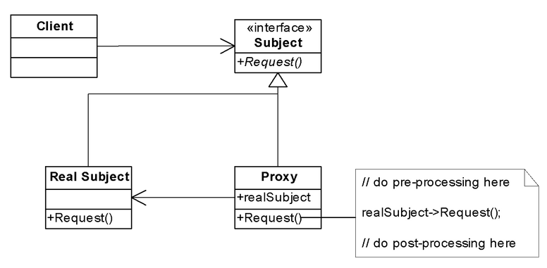

# Proxy

## Problem

You need to control access to an object

## Solution

- Create a proxy object that implements the same interface as the real object

- Proxy is a structural design pattern that provides an object that acts as substitute for a real service object used by a client. A proxy receives client requests, does some work (access control, caching, etc.) and then passes the request to a service object

- The Proxy object (usually) contains a reference to the real object

- Clients are given a reference to the Proxy, not the real object

- All client operations ont he object pass through the Proxy, allowing the Proxy o perform additional processing

## Diagram

## Types

- *Remote*
- *Virtual*
- *Protection*

### Remote

They are responsible for representing the object located remotely. Talking to the real object might involve marshalling and un-marshalling of data and talking to the remote object. All that logic is encapsulated in these proxies and the client application need not worry about them.

### Virtual

These proxies will provide some default and instant results if the real object is supposed to take some time to produce results. These proxies initiate the operation on real objects and provide a default result to the application. Once the real object is done, these proxies push the actual data to the client where it has provided dummy data earlier.

### Protection

If an application does not have access to some resource then such proxies will talk to the objects in applications that have access to that resource and then get the result back.

## Applications

- Collections,
  - Read-only collections
  - Synchronized Collections
- Distributed Objects
  - The Client and Real Subject are in different processes or on different machines, and so a direct method call will not work
- Secure Objects
  - Different clients have different level of access privileges to an object
  - Clients access the object through a proxy
  - The proxy either allows or rejects a method call depending on what method is being called and who is calling it (i.e., the client's identity)
- Lazy Loading (Lazy Initialization)
  - Some objects are expensive to instantiate (i.e., consume lots of resources or  take a long time to initialize)
  - Rather than instantiating an expensive object right away, create a proxy instead, and give the proxy to the client
  - The proxy creates the object on demand when the client first uses it
  - If the client never uses the object, the expense of creating it is never incurred
- Reference Counting
  - Proxies maintain the reference count inside the object
  - The last proxy to go away is responsible for deleting the object (i.e., when the reference count goes to 0, delete the object)
