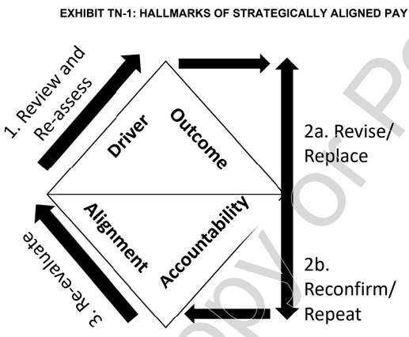
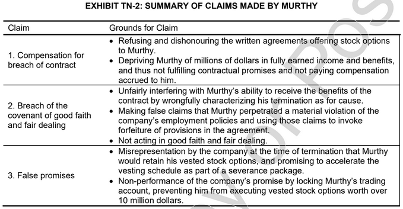

# Breach Of Agreement

## Table Of Contents

- [Breach Of Agreement](#breach-of-agreement)
  - [Table Of Contents](#table-of-contents)
  - [iGate](#igate)
    - [Position In Course](#position-in-course)
  - [Importance of compensation for a CEO as a strategic tool for aligning a company's key talent with the overall business strategy](#importance-of-compensation-for-a-ceo-as-a-strategic-tool-for-aligning-a-companys-key-talent-with-the-overall-business-strategy)
    - [Aligning Executive Compensation With Strategy](#aligning-executive-compensation-with-strategy)
  - [How can organization design executive compensation to align with business strategy using risk and reward distribution?](#how-can-organization-design-executive-compensation-to-align-with-business-strategy-using-risk-and-reward-distribution)
    - [Optimal Contracting Approach](#optimal-contracting-approach)
    - [Managerial Power Approach](#managerial-power-approach)
    - [Role Of The Board Of Directors](#role-of-the-board-of-directors)
    - [Indemnity Clause](#indemnity-clause)
    - [Claw-back Provision](#claw-back-provision)
  - [Examine the employment agreement Murthy and iGATE and highlight the clauses that led to the dispute between the parties](#examine-the-employment-agreement-murthy-and-igate-and-highlight-the-clauses-that-led-to-the-dispute-between-the-parties)
    - [Wrongful Termination](#wrongful-termination)
    - [Senior Executive Employment Agreement](#senior-executive-employment-agreement)
  - [Why is it important for organizations to eliminate ambiguity in employment agreements with senior executives?](#why-is-it-important-for-organizations-to-eliminate-ambiguity-in-employment-agreements-with-senior-executives)
  - [What Happens?](#what-happens)
  - [Diagrams](#diagrams)
  - [References](#references)

## iGate

- May 2013
- Murthy as CEO
- "For cause"
- In March 2014, iGate filed a counter-suit demanding compensation from Murthy for all damages absorbed by the company due to Murthy's actions
- What were the implications of ending a senior executive's agreement for cause when there was ambiguity in defining "for cause"?

### Position In Course

- **Human Resource Management**
- **Employment Law**
- **Contract Management**
- **Compensation Management**
- **Corporate Governance**

## Importance of compensation for a CEO as a strategic tool for aligning a company's key talent with the overall business strategy

The case discussion may begin with an examination of the larger context; highlighting the importance of CEOs in organizations.

CEOs are expected to provide strategic direction to an organization, taking into account the business environment, organizational history, and past performance. CEOs formulate and implement company strategies, and, therefore, are largely held accountable for the company's performance and outcomes.

Senior executives, such as CEOs and chief financial officers, are generally compensated differently than employees at lower hierarchical levels.

- **Base Salary**: This is a fixed compensation element, generally set to be competitive and benchmarked against the market.
- **Bonuses**: Four common types are,
  - **Discretionary Bonus**
  - **Performance Contingent Bonus**
  - **Pre-Determined Allocation Bonus**
  - **Target Plan Bonus**
- **Short-Term Incentives**: They are usually provided through profit-sharing or gain-sharing plans.
- **Long-Term Incentives**: Incentives include stock options, restricted stocks, stock appreciation rights, and phantom stocks.
- **Benefits**:
  - **Enhanced Protection Program Benefits**
  - **Perquisites**
- **Loss-of-office Payments**
  - Safeguard interests
  - Motivate
  - Facilitate quick replacements

### Aligning Executive Compensation With Strategy

Compensation of executives often called as outrageous and contentious.

- **Driver & Outcome Metrics**
  - A CEO and the organization's board members must agree on an appropriate criterion for assessing performance, and suitable compensation should be set according to the success in achieving these objectives
- **Alignment & Accountability**
  - The board must perform due diligence to ensure that pay for performance and equity compensation align with the company's goals and objectives.

## How can organization design executive compensation to align with business strategy using risk and reward distribution?

The current business environment demands a comprehensive compensation strategy that considers,

- Competition
- Corporate
- Governance
- Market Volatility

### Optimal Contracting Approach

- Based on agency theory of corporate governance
- Board acts on behalf of its stakeholders (the principals)
- These contracts define the terms of employment as relative to performance standards, determining current and deferred compensation packages

### Managerial Power Approach

- Alternate view to the optimal contracting model argues that compensation contracts in practice are not generally bargained with stakeholders from a distance
- "Extracting Rent"
- Demand vs supply of outstanding talent in top management
- CEO's pay may be set as high as possible and subsequent amendments made that are not constrained to principal-agent problems.
- Murthy played a pivotal role in transforming a loss-incurring, mid-tier company into a billion-dollar entity
- After successfully assuming the critical role of strategic driver in the acquisition of Patni Computer systems, Murthy took responsibility for integrating iGATE and Patni
- Murthy negotiated salary from US $3.14 M in 2010, to $8.82 M in 2011
- Board agreed to increase Murthy's severance notice period from 6 to 12 months

### Role Of The Board Of Directors

In its claims against Murthy, iGATE claimed that it included provisions for termination "for cause" and indemnity in Murthy's executive's contract to mitigate risk in case of exigencies.

### Indemnity Clause

An indemnity clause is a way to shift potential costs to another party, obligating one party to pay the expenses or losses incurred by another under specific circumstances.

Relying on the indemnity clause in Murthy's contract, the company demanded that Murthy compensate iGATE for its losses incurred as a result of Murthy's failure to report his relationship with a subordinate.

iGATE wanted to recover its legal fees and other costs incurred to settle Roiz's claims against Murthy and the company.

### Claw-back Provision

Compensation "clawbacks" may be used in executive contracts as a type of indemnity clause, providing the company with another safeguard against losses.

Clawbacks can include,

- Deductions/Non-payments/Severance Payments for violating restrictions on "ethical misconduct" resulting in termination "**for cause**".

It helps to mitigate risk in cases of eventuality.

It authorizes employer to,

- Recover previously paid compensation from an employer in event of financial statement errors
- Require employer to forfeit deferred compensation

## Examine the employment agreement Murthy and iGATE and highlight the clauses that led to the dispute between the parties

After Murthy's termination from iGATE for allegedly violating company policy by not reporting his relationship with a junior employee, Murthy filed a lawsuit against the company for wrongful termination.

### Wrongful Termination

"**A wrongful termination is generally understood as termination of a contract by a party without having justified reasons**"

Neither the general principles of contract law applicable to the contracting parties nor the terms of the contract itself provide a reason.

iGATE termination Murthy on basis of violating company policy, thus the termination was "**for cause**".

If iGATE's justification was accepted under the [employee] agreement, Murthy could not claim 12 months of severance pay. Murthy would also lose his stock options.

### Senior Executive Employment Agreement

The employment agreement promised Murthy,

- An annual base salary
- Performance-based incentive bonus

This employment agreement was amended on several occasions to increase Murthy’s annual base salary and performance-based incentive bonus, with further provisions for bonuses added depending on the
company’s performance.

The amended employment agreement stated that Murthy was,

- Entitled to 12 months’ notice of termination

Should iGATE fail to provide him with advance written notice, Murthy
would be entitled to a **severance package** equal to 12 months of his annual salary and performance-based incentive.

Other considerations were about,

- **Murthy's Stock Options**: iGATE reportedly prevented Murthy from selling his stock options prior to May 2013 because it might send a negative message and devalue iGATE's stock price
- **Family Benefits**: iGATE agreed to pay for Murthy's and his family's long term health insurance, should be leave iGATE

## Why is it important for organizations to eliminate ambiguity in employment agreements with senior executives?

Murthy’s lawsuit against iGATE is a classic example of a dispute resulting from a high-level employee’s termination from a company for reasons unsatisfactory to the terminated employee. Most high-level employee contracts include hefty severance compensation and benefits should the employee be terminated “without cause,” but no such provisions if terminated for cause. Disagreements hinge on whether the circumstances surrounding the employee’s termination met the established definition of cause; thus, an ambiguous, unclear, or debatable definition may be the root cause of a dispute.

iGATE declared Murthy’s termination to be for cause. Murthy rejected this determination, claiming that his termination was without cause.

Thus, the definition of cause in the employee agreement must be analyzed.

Section 6 required Murthy to abide by all company rules, regulations, instructions, policies, practices, and procedures, as amended on occasion and posted on the company’s intranet. iGATE argued that Murthy’s termination was **for cause** because he violated it by not disclosing the relationship.

In summary, iGATE expected Murthy to expressly disclose his relationship with the junior employee, while Murthy never felt any such requirement because the relationship was already known to the board members.

Careful examination of the definition of cause in the agreement and the company’s policy on reporting relationships revealed that expressly disclosing the relationship would neither constitute nor prevent termination for cause. The terms of the employment agreement and the related company policy did not address the issue sufficiently. The employment agreement or company policy should have made it clear
which actions and circumstances would justify a termination for cause.

This case provides a lesson for companies that wish to avoid post-termination disputes. Demonstrably, it is important to give special care to definitions of cause in employment agreements with high-level employees. If the employment agreement references other documents, concepts, or sources (e.g., company policy), these documents, concepts, and sources must also be defined clearly. In the present case, the company’s policy that no employee could materially breach the policy’s clauses and still receive severance was supposedly available on the company’s intranet. Another clause in the policy demanded that any employee engaged in a romantic relationship with a junior employee disclose the relationship to the company. However, company policy did not specifically require employees to report these relationships (like the one Murthy had with Roiz) in a specific manner; for example, was an informal disclosure sufficient or was the employee required to report the relationship in a letter addressed to the next senior employee? Therefore, there was some ambiguity in the company’s policy.

## What Happens?

The dispute between Murthy and iGATE ended with an out-of-court settlement, with both parties agreeing not to disclose details about the terms and the nature of the legal settlement. The company was said to have paid a lump sum to settle the breach of contract and defamation case filed by Murthy.24 In its annual earnings report of 2014, iGATE showed an expenditure of $4.6 million incurred for legal settlements to Murthy, though it did not reveal the details.

## Diagrams

## References

- [Breach Of Agreement](https://drive.google.com/file/d/1DGv0wxnTLH2J2Aqr42MFwt1Xv95tQWG-/view)
